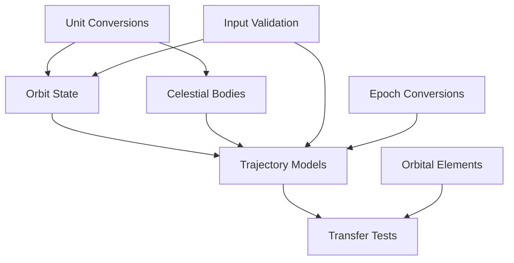

# Trajectory Tests Documentation

This document provides an overview of the test suites in the trajectory module, organized by complexity and importance.

## Core Tests (High Priority)

### 1. Orbit State Tests (`test_orbit_state.py`)
**Importance**: Critical - Validates fundamental orbit state representations
**Complexity**: High

Tests the core orbit state functionality:
- State vector to orbital elements conversion
- Orbital elements to state vector conversion
- Parameter validation and bounds checking
- Unit conversions between km and m
- Integration with PyKEP planet objects

### 2. Celestial Body State Tests (`test_celestial_bodies.py`)
**Importance**: Critical - Validates celestial mechanics calculations
**Complexity**: High

Tests celestial body state calculations:
- Earth state in heliocentric frame
- Moon state in heliocentric frame
- Moon state in Earth-centered frame
- Local reference frame transformations
- SPICE kernel integration and error handling

### 3. Trajectory Models Tests (`test_trajectory_models.py`)
**Importance**: High - Ensures core data structures work correctly
**Complexity**: High

Tests trajectory model components:
- Orbit state validation (bounds, units)
- Maneuver delta-v and timing validation
- Trajectory sequence validation
- Time ordering constraints
- State propagation accuracy

## Transfer Tests (High Priority)

### 4. Lambert Solver Tests (`test_lambert_solver.py`)
**Importance**: High - Validates core transfer calculations
**Complexity**: Medium

Tests Lambert problem solutions:
- Single revolution transfers
- Multiple revolution options
- Edge cases and convergence
- Unit handling for inputs/outputs
- Integration with PyKEP solver

### 5. Hohmann Transfer Tests (`test_hohmann_transfer.py`)
**Importance**: High - Validates specific transfer type
**Complexity**: Medium

Tests Hohmann transfer calculations:
- Circular to circular orbits
- Delta-v calculations
- Transfer time computation
- Phasing considerations
- Edge cases (similar orbits)

### 6. Lunar Transfer Tests (`test_lunar_transfer.py`)
**Importance**: High - Tests mission-specific scenarios
**Complexity**: High

Tests lunar trajectory generation:
- Earth departure conditions
- Lunar arrival constraints
- Multiple revolution options
- Transfer component validation
- Mission constraints handling

## Supporting Tests (Medium Priority)

### 7. Orbital Elements Tests (`test_elements.py`)
**Importance**: High - Validates core orbital mechanics calculations
**Complexity**: Medium

Tests orbital element calculations and conversions:

1. **Orbital Period Tests**
   - ISS orbital period (~90 minutes)
   - Lunar orbital period (~27.3 days)
   - Validation against real celestial bodies
   - Edge case handling for invalid parameters

2. **Orbital Velocity Tests**
   - Circular orbit velocity components
   - Elliptical orbit velocity variations
   - Periapsis/apoapsis velocity validation
   - Angular momentum conservation

3. **Anomaly Conversion Tests**
   - Mean to true anomaly conversion
   - True to mean anomaly conversion
   - Special case: circular orbits (ν = M)
   - Roundtrip conversion validation
   - Tests with various eccentricities (0.0 to 0.3)

4. **Test Coverage**
   - Standard orbital scenarios
   - Edge cases and boundary conditions
   - Numerical precision validation
   - Real-world parameter validation

### 8. Unit Conversion Tests (`test_unit_conversions.py`)
**Importance**: Medium - Ensures consistent units
**Complexity**: Low

Tests unit conversion utilities:
- Distance conversions (km ↔ m)
- Time conversions (various epochs)
- Angle conversions (deg ↔ rad)
- Velocity conversions
- Gravitational parameter conversions

### 9. Input Validation Tests (`test_input_validation.py`)
**Importance**: Medium - Ensures robust error handling
**Complexity**: Low

Tests input validation:
- Parameter bounds checking
- Type validation
- Required field validation
- Error message clarity
- Edge case handling

### 10. Epoch Conversion Tests (`test_epoch_conversions.py`)
**Importance**: Medium - Ensures consistent time handling
**Complexity**: Low

Tests time conversion utilities:
- UTC to MJD2000
- J2000 conversions
- Timezone handling
- Leap second consideration
- String format parsing

## Test Dependencies

## Test Coverage Requirements

### Critical Components (100% coverage)
- Orbit state conversions
- Celestial body state calculations
- Transfer calculations
- Input validation

### Core Components (>90% coverage)
- Trajectory models
- Unit conversions
- Time handling
- Orbital elements

### Supporting Components (>80% coverage)
- Edge cases
- Error handling
- Performance optimization

## Future Test Improvements

1. **Integration Testing**
   - End-to-end mission scenarios
   - Multi-body trajectory optimization
   - Real mission data validation

2. **Performance Testing**
   - Computation time benchmarks
   - Memory usage optimization
   - Numerical stability tests

3. **Error Handling**
   - Extended edge case coverage
   - Graceful degradation tests
   - Recovery scenario validation 