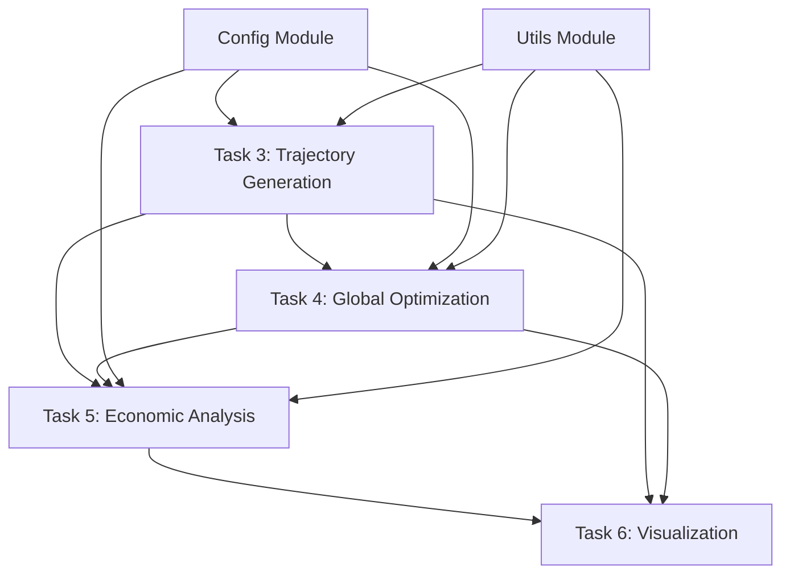

# Integration Guide - Tasks 3, 4, and 5

## Overview

This guide provides comprehensive integration instructions for the three major modules completed in the Lunar Horizon Optimizer project:
- **Task 3**: Enhanced Trajectory Generation
- **Task 4**: Global Optimization Module  
- **Task 5**: Basic Economic Analysis Module

## Integration Architecture

### Module Dependencies



### Integration Points

#### 1. Task 3 ↔ Task 4 Integration
**Connection**: Trajectory generation provides fitness evaluation for optimization

```python
# Task 4 uses Task 3 for trajectory evaluation
from trajectory.lunar_transfer import LunarTransfer
from optimization.global_optimizer import LunarMissionProblem

class LunarMissionProblem:
    def __init__(self):
        self.lunar_transfer = LunarTransfer()  # Task 3 integration
    
    def fitness(self, x):
        # Use Task 3 to generate trajectory
        trajectory, total_dv = self.lunar_transfer.generate_transfer(...)
        return [total_dv, transfer_time, cost]
```

#### 2. Task 3 ↔ Task 5 Integration
**Connection**: Trajectory parameters feed into economic cost calculations

```python
# Task 5 uses Task 3 trajectory data for cost estimation
from trajectory.lunar_transfer import LunarTransfer
from economics.cost_models import MissionCostModel

def calculate_mission_economics(trajectory_params):
    # Generate trajectory using Task 3
    trajectory, total_dv = LunarTransfer().generate_transfer(**trajectory_params)
    
    # Calculate costs using Task 5
    cost_model = MissionCostModel()
    costs = cost_model.estimate_total_mission_cost(
        spacecraft_mass=trajectory_params['spacecraft_mass'],
        total_dv=total_dv,
        transfer_time=trajectory_params['transfer_time']
    )
    
    return costs
```

#### 3. Task 4 ↔ Task 5 Integration
**Connection**: Economic analysis provides cost objectives for optimization

```python
# Task 4 uses Task 5 for economic objective evaluation
from optimization.cost_integration import CostCalculator
from economics.financial_models import NPVAnalyzer

class LunarMissionProblem:
    def __init__(self):
        self.cost_calculator = CostCalculator()  # Task 5 integration
    
    def fitness(self, x):
        # Calculate trajectory (Task 3)
        trajectory, total_dv = self.generate_trajectory(x)
        
        # Calculate economics (Task 5)
        cost = self.cost_calculator.calculate_mission_cost(...)
        
        return [total_dv, transfer_time, cost]
```

## Complete Integration Example

### End-to-End Lunar Mission Optimization

```python
"""
Complete lunar mission optimization integrating Tasks 3, 4, and 5
"""
from datetime import datetime
import numpy as np

# Task 3 imports
from trajectory.lunar_transfer import LunarTransfer
from trajectory.transfer_window_analysis import TrajectoryWindowAnalyzer

# Task 4 imports
from optimization.global_optimizer import GlobalOptimizer, LunarMissionProblem
from optimization.pareto_analysis import ParetoAnalyzer

# Task 5 imports
from economics.financial_models import CashFlowModel, NPVAnalyzer
from economics.cost_models import MissionCostModel
from economics.reporting import EconomicReporter, FinancialSummary

# Configuration
from config.costs import CostFactors

class IntegratedLunarMissionOptimizer:
    """Complete lunar mission optimizer integrating all three tasks."""
    
    def __init__(self):
        # Initialize components from all tasks
        self.trajectory_analyzer = TrajectoryWindowAnalyzer()  # Task 3
        self.cost_factors = CostFactors()                      # Config
        self.economic_reporter = EconomicReporter()           # Task 5
        
    def optimize_mission(self, mission_config):
        """Perform complete mission optimization."""
        
        # Step 1: Find optimal launch windows (Task 3)
        launch_windows = self.trajectory_analyzer.find_transfer_windows(
            start_date=mission_config['start_date'],
            end_date=mission_config['end_date'],
            earth_orbit_alt=mission_config['earth_alt'],
            moon_orbit_alt=mission_config['moon_alt']
        )
        
        print(f"Found {len(launch_windows)} launch windows")
        
        # Step 2: Multi-objective optimization (Task 4)
        problem = LunarMissionProblem(
            cost_factors=self.cost_factors,
            min_earth_alt=mission_config['min_earth_alt'],
            max_earth_alt=mission_config['max_earth_alt'],
            min_moon_alt=mission_config['min_moon_alt'],
            max_moon_alt=mission_config['max_moon_alt']
        )
        
        optimizer = GlobalOptimizer(problem, population_size=100, num_generations=100)
        optimization_results = optimizer.optimize()
        
        print(f"Found {len(optimization_results['pareto_solutions'])} Pareto solutions")
        
        # Step 3: Economic analysis of top solutions (Task 5)
        pareto_analyzer = ParetoAnalyzer()
        analyzed_results = pareto_analyzer.analyze_pareto_front(optimization_results)
        
        # Get top 3 solutions for economic analysis
        top_solutions = analyzed_results.get_best_solutions('delta_v', 3)
        
        economic_analyses = []
        for solution in top_solutions:
            economic_analysis = self.perform_economic_analysis(solution)
            economic_analyses.append(economic_analysis)
        
        # Step 4: Generate comprehensive report
        report = self.generate_integrated_report(
            launch_windows, optimization_results, economic_analyses
        )
        
        return {
            'launch_windows': launch_windows,
            'optimization_results': optimization_results,
            'economic_analyses': economic_analyses,
            'report': report
        }
    
    def perform_economic_analysis(self, solution):
        """Perform detailed economic analysis for a solution."""
        
        # Extract solution parameters
        params = solution['parameters']
        objectives = solution['objectives']
        
        # Create cash flow model (Task 5)
        cash_model = CashFlowModel()
        start_date = datetime(2025, 1, 1)
        
        # Add costs based on solution
        development_cost = 100e6 * (1 + (objectives['delta_v'] - 3000) / 10000)
        launch_cost = 50e6
        ops_cost = 5e6 * params['transfer_time'] / 4.0  # Scale with transfer time
        
        cash_model.add_development_costs(development_cost, start_date, 24)
        cash_model.add_launch_costs(launch_cost, [start_date])
        cash_model.add_operational_costs(ops_cost, start_date, 36)
        
        # Add revenues (simplified)
        cash_model.add_revenue_stream(8e6, start_date, 36)
        
        # Calculate NPV
        npv_analyzer = NPVAnalyzer()
        npv = npv_analyzer.calculate_npv(cash_model)
        irr = npv_analyzer.calculate_irr(cash_model)
        
        # Create financial summary
        summary = FinancialSummary(
            total_investment=development_cost + launch_cost,
            net_present_value=npv,
            internal_rate_of_return=irr,
            payback_period_years=npv_analyzer.calculate_payback_period(cash_model)
        )
        
        return {
            'solution': solution,
            'financial_summary': summary,
            'cash_model': cash_model
        }
    
    def generate_integrated_report(self, launch_windows, optimization_results, economic_analyses):
        """Generate comprehensive integrated report."""
        
        report_sections = []
        
        # Launch window analysis summary
        report_sections.append("LAUNCH WINDOW ANALYSIS")
        report_sections.append("=" * 25)
        report_sections.append(f"Analyzed windows: {len(launch_windows)}")
        if launch_windows:
            best_window = min(launch_windows, key=lambda w: w.total_dv)
            report_sections.append(f"Best window: {best_window.departure_date} (ΔV: {best_window.total_dv:.0f} m/s)")
        
        # Optimization results summary
        report_sections.append("\nOPTIMIZATION RESULTS")
        report_sections.append("=" * 20)
        report_sections.append(f"Pareto solutions: {len(optimization_results['pareto_solutions'])}")
        
        cache_stats = optimization_results.get('cache_stats', {})
        if cache_stats:
            report_sections.append(f"Cache efficiency: {cache_stats.get('hit_rate', 0):.1%}")
        
        # Economic analysis summary
        report_sections.append("\nECONOMIC ANALYSIS")
        report_sections.append("=" * 17)
        
        for i, analysis in enumerate(economic_analyses, 1):
            summary = analysis['financial_summary']
            report_sections.append(f"\nSolution {i}:")
            report_sections.append(f"  NPV: ${summary.net_present_value/1e6:.1f}M")
            report_sections.append(f"  IRR: {summary.internal_rate_of_return:.1%}")
            report_sections.append(f"  Payback: {summary.payback_period_years:.1f} years")
        
        return "\n".join(report_sections)

# Usage example
def run_integrated_optimization():
    """Example of running complete integrated optimization."""
    
    mission_config = {
        'start_date': datetime(2025, 6, 1),
        'end_date': datetime(2025, 7, 1),
        'earth_alt': 400.0,
        'moon_alt': 100.0,
        'min_earth_alt': 200,
        'max_earth_alt': 800,
        'min_moon_alt': 50,
        'max_moon_alt': 300
    }
    
    optimizer = IntegratedLunarMissionOptimizer()
    results = optimizer.optimize_mission(mission_config)
    
    print("INTEGRATED LUNAR MISSION OPTIMIZATION COMPLETE")
    print("=" * 50)
    print(results['report'])
    
    return results

if __name__ == "__main__":
    results = run_integrated_optimization()
```

## Data Flow Integration

### 1. Trajectory → Economics Flow
```python
# Trajectory parameters become economic inputs
trajectory_params = {
    'total_dv': 3200,        # m/s (from Task 3)
    'transfer_time': 4.5,    # days (from Task 3)
    'earth_orbit_alt': 400,  # km (from Task 3)
    'moon_orbit_alt': 100    # km (from Task 3)
}

# Economics calculation (Task 5)
economics = calculate_mission_cost(**trajectory_params)
```

### 2. Economics → Optimization Flow
```python
# Economic objectives for optimization (Task 4)
def fitness_function(parameters):
    # Generate trajectory (Task 3)
    trajectory, dv = generate_trajectory(parameters)
    
    # Calculate cost (Task 5)  
    cost = calculate_cost(dv, parameters)
    
    # Return multi-objective fitness
    return [dv, trajectory.transfer_time, cost]
```

### 3. Optimization → Reporting Flow
```python
# Optimization results become reporting inputs
pareto_solutions = optimization_results['pareto_solutions']

for solution in pareto_solutions:
    # Extract solution data
    params = solution['parameters']
    objectives = solution['objectives']
    
    # Generate economic report (Task 5)
    financial_summary = create_financial_summary(params, objectives)
    report = generate_executive_summary(financial_summary)
```

## Configuration Integration

### Shared Configuration Objects

```python
# Shared configuration used across all tasks
from config.costs import CostFactors
from config.models import MissionConfig

# Task 3 configuration
trajectory_config = {
    'min_earth_alt': 200,
    'max_earth_alt': 1000,
    'min_moon_alt': 50,
    'max_moon_alt': 500
}

# Task 4 configuration  
optimization_config = {
    'population_size': 100,
    'num_generations': 100,
    'seed': 42
}

# Task 5 configuration
economic_config = CostFactors(
    launch_cost_per_kg=10000,
    operations_cost_per_day=100000,
    development_cost=1e9,
    contingency_percentage=20
)
```

## Error Handling Integration

### Unified Error Handling Strategy

```python
class LunarMissionError(Exception):
    """Base exception for lunar mission optimization."""
    pass

class TrajectoryGenerationError(LunarMissionError):
    """Task 3 trajectory generation errors."""
    pass

class OptimizationError(LunarMissionError):
    """Task 4 optimization errors."""
    pass

class EconomicAnalysisError(LunarMissionError):
    """Task 5 economic analysis errors."""
    pass

def safe_integrated_optimization(mission_config):
    """Integrated optimization with comprehensive error handling."""
    try:
        # Task 3: Trajectory generation
        trajectories = generate_trajectories(mission_config)
    except Exception as e:
        raise TrajectoryGenerationError(f"Trajectory generation failed: {e}")
    
    try:
        # Task 4: Optimization  
        optimization_results = optimize_mission(trajectories)
    except Exception as e:
        raise OptimizationError(f"Optimization failed: {e}")
    
    try:
        # Task 5: Economic analysis
        economic_results = analyze_economics(optimization_results)
    except Exception as e:
        raise EconomicAnalysisError(f"Economic analysis failed: {e}")
    
    return {
        'trajectories': trajectories,
        'optimization': optimization_results, 
        'economics': economic_results
    }
```

## Testing Integration

### Integrated Test Suite

```python
import unittest
from unittest.mock import patch, MagicMock

class TestIntegratedOptimization(unittest.TestCase):
    """Test suite for integrated Tasks 3, 4, 5."""
    
    def setUp(self):
        """Set up test fixtures."""
        self.mission_config = {
            'start_date': datetime(2025, 6, 1),
            'end_date': datetime(2025, 7, 1),
            'earth_alt': 400.0,
            'moon_alt': 100.0
        }
    
    def test_trajectory_to_economics_integration(self):
        """Test Task 3 → Task 5 integration."""
        # Generate trajectory (Task 3)
        trajectory_params = {'total_dv': 3200, 'transfer_time': 4.5}
        
        # Calculate economics (Task 5)
        cost = calculate_mission_cost(**trajectory_params)
        
        self.assertIsInstance(cost, float)
        self.assertGreater(cost, 0)
    
    def test_optimization_with_economics(self):
        """Test Task 4 with Task 5 objectives."""
        # Mock trajectory generation
        with patch('trajectory.lunar_transfer.LunarTransfer') as mock_transfer:
            mock_transfer.return_value.generate_transfer.return_value = (None, 3200)
            
            # Run optimization with economic objectives
            problem = LunarMissionProblem()
            fitness = problem.fitness([400, 100, 4.5])
            
            self.assertEqual(len(fitness), 3)  # Three objectives
            self.assertGreater(fitness[0], 0)  # Delta-v > 0
            self.assertGreater(fitness[2], 0)  # Cost > 0
    
    def test_end_to_end_integration(self):
        """Test complete end-to-end integration."""
        optimizer = IntegratedLunarMissionOptimizer()
        
        # Mock expensive operations for testing
        with patch.object(optimizer.trajectory_analyzer, 'find_transfer_windows') as mock_windows:
            mock_windows.return_value = [MagicMock()]
            
            with patch('optimization.global_optimizer.GlobalOptimizer') as mock_optimizer:
                mock_optimizer.return_value.optimize.return_value = {
                    'pareto_solutions': [{'parameters': {}, 'objectives': {}}]
                }
                
                results = optimizer.optimize_mission(self.mission_config)
                
                self.assertIn('launch_windows', results)
                self.assertIn('optimization_results', results)
                self.assertIn('economic_analyses', results)

if __name__ == '__main__':
    unittest.main()
```

## Performance Optimization

### Integrated Performance Considerations

1. **Caching Strategy**:
   - Task 3: Trajectory calculation caching
   - Task 4: Fitness evaluation caching  
   - Task 5: Cost calculation caching

2. **Memory Management**:
   - Shared data structures to minimize memory usage
   - Efficient numpy array handling across modules
   - Garbage collection for large optimization runs

3. **Parallel Processing**:
   - Task 4: PyGMO parallel population evaluation
   - Task 5: Parallel Monte Carlo simulations
   - Task 3: Parallel trajectory generation for multiple windows

## Deployment Integration

### Environment Setup

```bash
# Complete environment setup for integrated system
conda create -n py312 python=3.12 -y
conda activate py312

# Install core dependencies
conda install -c conda-forge pykep pygmo astropy spiceypy -y

# Install Python packages
pip install numpy scipy matplotlib plotly poliastro

# Install development dependencies
pip install pytest black flake8 mypy jupyter

# Verify installation
python scripts/verify_dependencies.py
```

### Integration Checklist

- [ ] All modules import successfully
- [ ] Shared configuration objects work across modules
- [ ] Data flows correctly between tasks
- [ ] Error handling is consistent
- [ ] Performance is acceptable for typical problems
- [ ] Tests pass for integrated scenarios
- [ ] Documentation is complete and accurate

---

**Last Updated**: December 2024  
**Status**: Ready for Implementation  
**Next Steps**: Implement Task 6 (Visualization) and Task 7 (MVP Integration)